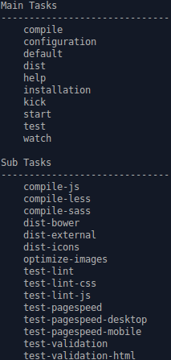

## Kickstarter CLI

### Tasks

Tasks can be executed by running `gulp <task> <othertask>`. Just running `gulp` will execute the watch task.
To know the list of available tasks, you can run the following command `gulp help`

If gulp is not installed globally, install it globally `npm install -g gulp`

### Description

* Main commands

|Command|Description|
|-----:|:-----------|
|`gulp kick`|Configure and install the kickstarter|
|`gulp start`|Use the kickstarter|

* Other commands

|Command|Description|
|-----:|:-----------|
|`gulp default` (or `gulp`)|Compile files and optimize images. Then launch the development environment|
|`gulp help`|Display the list of available commands|
|`gulp compile`|Compile less files in public/less folder (or sass files) and compile javascripts|
|`gulp configuration`|Check if the kickstarter is ready to use, configure the project|
|`gulp dist`|Install bower packages and install assets (fontawesome)|
|`gulp installation`|Re-Install kickstarter libraries|
|`gulp test`|Test pagespeed for mobile and desktop and test csslint, jslint and W3C html standards|
|`gulp watch`|Default task described above|

* Sub tasks

Sub tasks could be executed manually but it's not the good way to use the kickstarter

